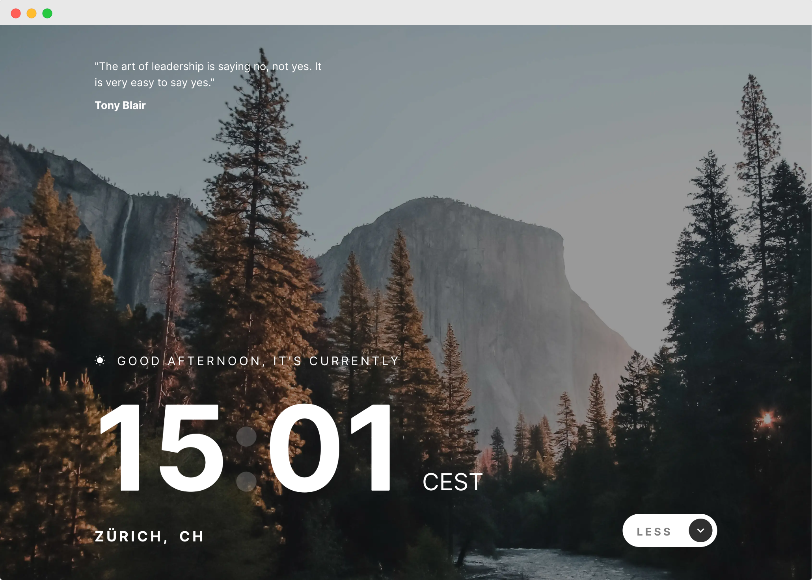

# FrontendMentor Challenge | Clock App

This is a challenge from FrontendMentor.   
You can find the description of the task here:   
[frontendmentor.io](https://www.frontendmentor.io/challenges/clock-app-LMFaxFwrM)



My goal in this challenge was to:
- get familiar with Ubuntu

### How to run
```bash
git clone https://github.com/jeromehaas/clock-app-fm
cd clock-app-fm
nvm use
npm install 
npm start
```